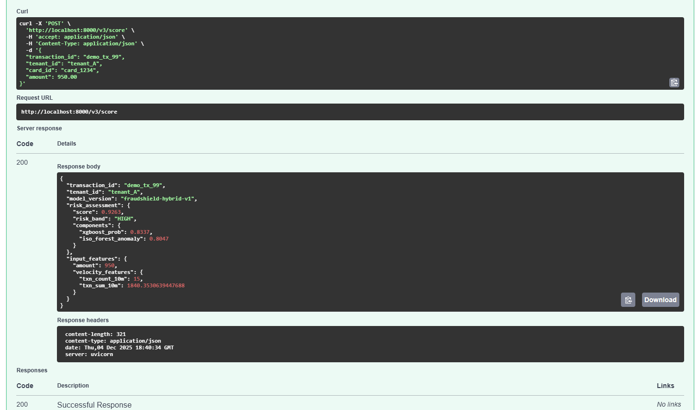
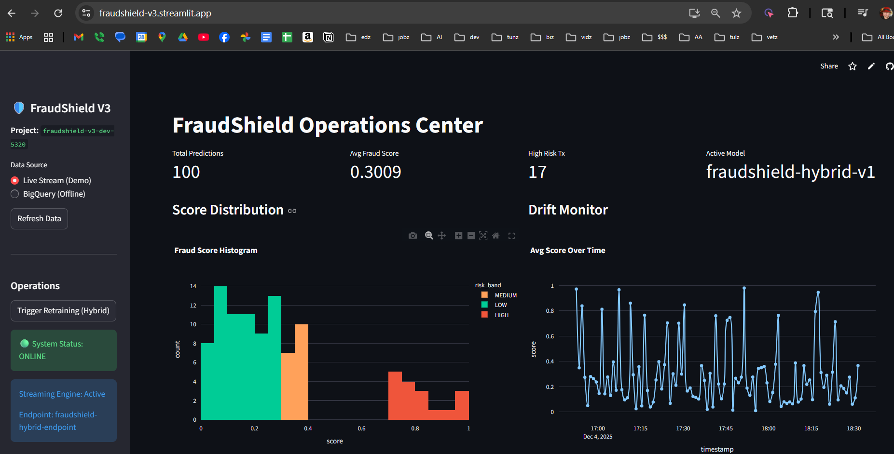

```mermaid
graph LR
    %% Styles
    classDef gcp_resource fill:#E8F5E9,stroke:#2E7D32,stroke-width:2px;
    classDef process fill:#E3F2FD,stroke:#1565C0,stroke-width:2px;
    classDef storage fill:#FFF3E0,stroke:#EF6C00,stroke-width:2px;
    classDef external fill:#F3E5F5,stroke:#7B1FA2,stroke-width:2px;

    %% Nodes
    Client(Client Application):::external
    PubSub(Cloud Pub/Sub<br>Raw Events Topic):::gcp_resource
    Dataflow(Cloud Dataflow<br>Streaming Pipeline<br>10m Sliding Window):::process
    FeatureStore[(Vertex AI Feature Store<br>Online Store)]:::storage
    BigQuery[(BigQuery<br>Offline Store)]:::storage
    GCS[(Cloud Storage<br>Model Artifacts)]:::storage
    API(FastAPI Service<br>Scoring API):::process
    Endpoint(Vertex AI Endpoint<br>Hybrid Model Endpoint):::gcp_resource

    subgraph CPR_Container [Custom Prediction Routine CPR]
        style CPR_Container fill:#FAFAFA,stroke:#333,stroke-dasharray: 5 5
        XGBoost(XGBoost Model<br>Supervised):::process
        IsoForest(Isolation Forest<br>Unsupervised):::process
        Ensemble(Ensemble Logic<br>Weighted Average):::process
    end

    %% Connections
    Client -->|1. Publish Txn| PubSub
    PubSub -->|2. Stream Events| Dataflow
    Dataflow -->|3. Write Aggregates| FeatureStore
    Dataflow -->|Archive Events + Features| BigQuery

    Client -->|4. POST /v3/score| API
    API -->|5. Fetch Features| FeatureStore
    FeatureStore -->|Return Features| API

    API -->|6. Send Vector| Endpoint
    Endpoint -. hosts .- CPR_Container
    Endpoint --> XGBoost
    Endpoint --> IsoForest
    XGBoost -->|Probability| Ensemble
    IsoForest -->|Anomaly Score| Ensemble
    Ensemble -->|7. Final Score| API
    API -->|8. Score + Reason Codes| Client

    GCS -->|Model Artifacts| Endpoint
```

# FraudShield V3 – Real-Time Transaction Fraud Detection (GCP | Feature Store | Hybrid CPR Model)

FraudShield V3 is an end-to-end **real-time fraud detection system** built on **Google Cloud Platform** with a **Custom Prediction Routine (CPR)** hybrid model, online feature lookups, and a streaming ingestion pipeline.

This version demonstrates **enterprise-grade MLOps patterns**, including:

- **Real-time ingestion:** Pub/Sub → Dataflow (10-minute event-time sliding windows)
- **Online feature serving:** Vertex AI Feature Store
- **Hybrid modeling:** XGBoost (supervised) + Isolation Forest (unsupervised) + ensemble logic
- **Model artifacts & deployment:** Cloud Storage + Vertex AI Endpoint
- **Low-latency online scoring:** FastAPI service
- **Offline analytics & audit:** BigQuery (predictions, drift, feature distributions)
- **Infrastructure-as-Code:** Terraform for GCP provisioning

---

## 📐 Architecture Diagram



---

## 🧠 Key Features

### Hybrid Scoring Model (CPR Architecture)
FraudShield V3 uses a **Custom Prediction Routine** to combine:

- **XGBoost** for supervised fraud classification  
- **Isolation Forest** for unsupervised anomaly detection  
- **A weighted ensemble** for a final normalized fraud probability  

---

## ⚙️ Dataflow Streaming Pipeline

- Event-time 10-minute sliding aggregation window  
- Transaction velocity features (per `tenant_id` and `card_id`)  
- Handles out-of-order event compensation  
- Writes to **Vertex AI Feature Store**  
- Archives to **BigQuery** for analytics  

---

## 🧩 Online Scoring API (FastAPI)

1. Accepts `POST /v3/score`
2. Fetches online features from Feature Store
3. Sends vector to Vertex Endpoint
4. Returns fraud score + metadata

---

## 📦 Model Management

- Artifacts in **GCS**
- Deployment to **Vertex AI Endpoint**
- Supports versioning & rollbacks

---

## 📊 Monitoring & Observability

Logged to BigQuery:

- Predictions  
- Feature snapshots  
- Drift metrics  
- Errors  

---

## 🏗️ Infrastructure-as-Code (Terraform)

Terraform provisions:

- Pub/Sub  
- Dataflow  
- Feature Store entities  
- Vertex Endpoint  
- BigQuery datasets  
- IAM  
- GCS buckets  

---

## 📁 Repository Structure

```
fraudshield-v3/
├── api/
├── streaming/
├── models/
├── terraform/
├── artifacts/
└── README.md
```

---

## 📬 Contact

**Greg Burns — Machine Learning Engineer**  
LinkedIn: https://www.linkedin.com/in/gregburns/  
Portfolio: https://burnsgregm.netlify.app
